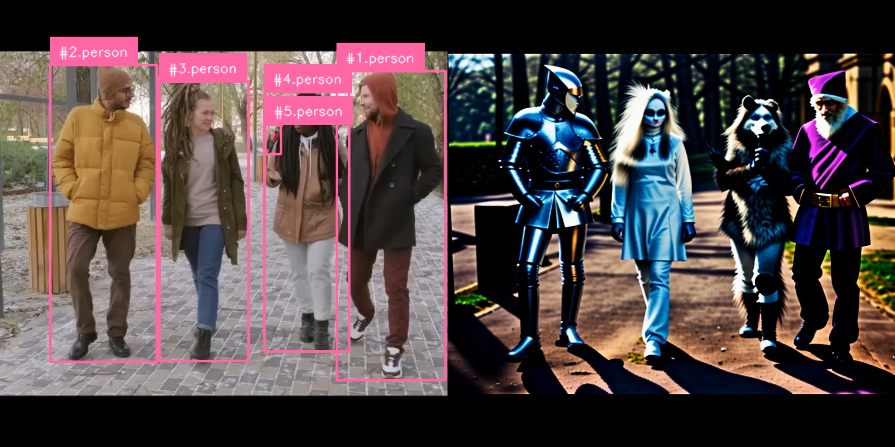

# ComfyUI-InstanceDiffusion
ComfyUI nodes to use InstanceDiffusion.

Original research repo: https://github.com/frank-xwang/InstanceDiffusion

## Table of Contents
- [Installation](#installation)
  - [How to Install](#how-to-install)
  - [How to Configure Models](#how-to-configure-models)
- [Examples](#examples)

## Installation

### How to Install
Clone or download this repo into your `ComfyUI/custom_nodes/` directory.
Then run `pip install -r requirments.txt` within the cloned repo (although if you have already set up ComfyUI you should have all these requirements already).

### How to Configure Models
Download each of these checkpoints and place them into the Installation Directory within `ComfyUI/custom_nodes/ComfyUI-InstanceDiffusion/` directory created.

| Model Name | URL | Installation Directory |
|------------|-----|------------------------|
| fusers.ckpt     | [huggingface](https://huggingface.co/spaces/logtd/instancediffusion/blob/main/fusers.ckpt) | `instance_models/fuser_models/`      |
| positionnet.ckpt     | [huggingface](https://huggingface.co/spaces/logtd/instancediffusion/blob/main/position_net.ckpt) | `instance_models/positionnet_models/`      |
| scaleu.ckpt     | [huggingface](https://huggingface.co/spaces/logtd/instancediffusion/blob/main/scaleu.ckpt) | `instance_models/scaleu_models/`      |

## Nodes
TODO

## Accompanying Node Repos
* [Tracking Nodes for videos](https://github.com/logtd/ComfyUI-TrackingNodes)

## Examples
Example workflows can be found in the `example_workflows/` directory.

## Acknowledgements
* [frank-xwang](https://github.com/frank-xwang) for creating the original repo, training models, etc.
* [Kosinkadink](https://github.com/Kosinkadink) for creating AnimateDiff-Evolved and providing support on integration
